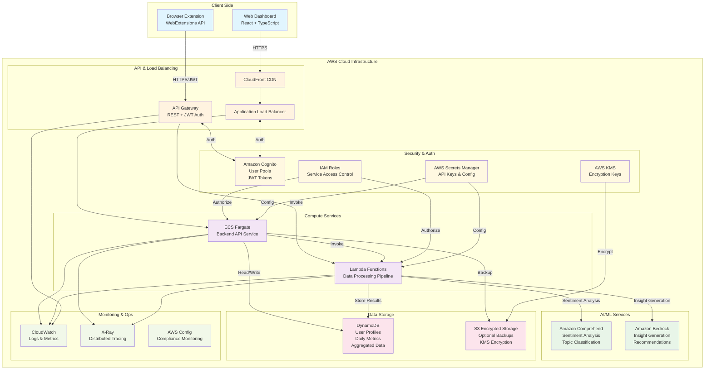
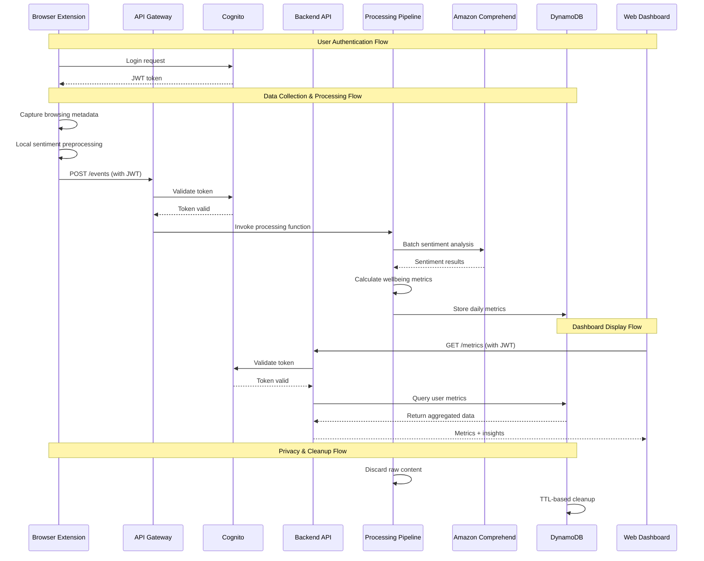
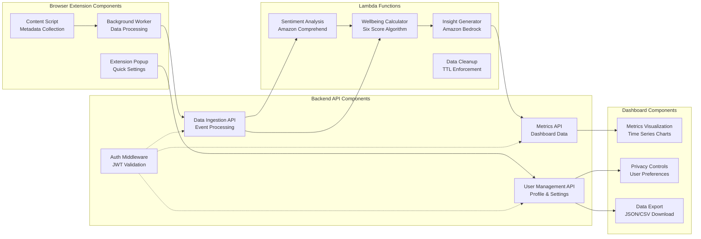

# Design Document: Mindful Browse

## Overview

Mindful Browse is a privacy-first digital wellbeing application that helps users understand the emotional footprint of their daily web usage. The system consists of a browser extension that captures minimal browsing metadata and a cloud-based backend that processes this data to generate wellbeing insights using established metrics from sentiment analysis and digital wellbeing research.

The architecture follows a privacy-by-design approach, collecting only necessary metadata, processing it through AWS AI/ML services, and storing aggregated metrics while discarding raw content. Users receive actionable insights about their digital consumption patterns through a responsive web dashboard.

## Architecture

### High-Level Architecture



### Detailed Data Flow Architecture



### Component Interaction Diagram



### AWS Technology Stack

**Compute Services:**
- **Amazon ECS Fargate**: Serverless container hosting for the main backend API
- **AWS Lambda**: Event-driven functions for data processing and ML inference
- **Application Load Balancer**: High-availability load balancing for web dashboard

**AI/ML Services:**
- **Amazon Comprehend**: Real-time sentiment analysis and topic classification
- **Amazon Bedrock**: Advanced insight generation and personalized recommendations (Phase 2)

**Storage Services:**
- **Amazon DynamoDB**: NoSQL database for aggregated daily metrics and user profiles
- **Amazon S3**: Encrypted backup storage for user data (opt-in only)
- **AWS KMS**: Encryption key management for data at rest

**Security Services:**
- **Amazon Cognito**: User authentication and authorization
- **AWS IAM**: Role-based access control for service-to-service communication
- **AWS Secrets Manager**: Secure storage of API keys and configuration

**Networking & API:**
- **Amazon API Gateway**: RESTful API management with throttling and monitoring
- **Amazon CloudFront**: CDN for web dashboard static assets
- **AWS Certificate Manager**: SSL/TLS certificate management

**Monitoring & Operations:**
- **Amazon CloudWatch**: Logging, monitoring, and alerting
- **AWS X-Ray**: Distributed tracing for performance optimization
- **AWS Config**: Compliance monitoring and configuration management

## Components and Interfaces

### Browser Extension Component

**Technology**: JavaScript/TypeScript with WebExtensions API
**Responsibilities**:
- Capture browsing metadata (page titles, timestamps, domain)
- Extract headlines/excerpts where technically accessible
- Perform local sentiment preprocessing
- Queue and batch data for transmission
- Manage user privacy settings

**Key Interfaces**:
```typescript
interface BrowsingEvent {
  timestamp: number;
  domain: string;
  pageTitle: string;
  excerpt?: string;
  sessionId: string;
}

interface LocalSentimentData {
  eventId: string;
  preliminaryTone: 'positive' | 'neutral' | 'negative';
  topicHints: string[];
}
```

**AWS Integration**:
- Authenticates via Amazon Cognito User Pools
- Sends data to API Gateway endpoints
- Uses JWT tokens for secure communication

### Backend API Service

**Technology**: Node.js/TypeScript running on Amazon ECS Fargate
**Responsibilities**:
- Validate and authenticate incoming requests
- Orchestrate data processing workflows
- Manage user accounts and preferences
- Serve dashboard API endpoints
- Handle data retention policies

**Key Interfaces**:
```typescript
interface UserProfile {
  userId: string;
  preferences: PrivacySettings;
  baselineMetrics: WellbeingBaseline;
  createdAt: Date;
  lastActive: Date;
}

interface ProcessingRequest {
  userId: string;
  events: BrowsingEvent[];
  processingOptions: {
    enableSentiment: boolean;
    enableTopicClassification: boolean;
  };
}
```

**AWS Integration**:
- Deployed on ECS Fargate with auto-scaling
- Uses IAM roles for service authentication
- Integrates with DynamoDB for data persistence
- Triggers Lambda functions for ML processing

### Data Processing Pipeline

**Technology**: AWS Lambda functions with Python runtime
**Responsibilities**:
- Process browsing events through Amazon Comprehend
- Calculate wellbeing metrics using established algorithms
- Aggregate daily scores and trends
- Generate insights and recommendations

**Key Processing Functions**:

```python
# Sentiment Analysis Function
def analyze_sentiment(text_batch: List[str]) -> List[SentimentResult]:
    # Uses Amazon Comprehend for batch sentiment analysis
    pass

# Wellbeing Metrics Calculator
def calculate_wellbeing_metrics(events: List[ProcessedEvent]) -> DailyMetrics:
    # Implements research-based scoring algorithms
    pass

# Insight Generation Function  
def generate_insights(user_metrics: UserMetricsHistory) -> List[Insight]:
    # Uses Amazon Bedrock for personalized recommendations
    pass
```

**AWS Integration**:
- Triggered by API Gateway or EventBridge
- Uses Amazon Comprehend for sentiment analysis
- Stores results in DynamoDB
- Integrates with Amazon Bedrock for advanced insights

### Web Dashboard

**Technology**: React/TypeScript with AWS Amplify hosting
**Responsibilities**:
- Display wellbeing metrics and trends
- Provide interactive data visualizations
- Manage user privacy settings
- Export user data on request

**Key Components**:
```typescript
interface DashboardProps {
  userMetrics: DailyMetrics[];
  insights: Insight[];
  privacySettings: PrivacySettings;
}

interface MetricsVisualization {
  informationOverload: TimeSeriesData;
  negativeContentBias: TimeSeriesData;
  emotionalLoadScore: TimeSeriesData;
  doomscrollIndex: TimeSeriesData;
  cognitiveDiversityScore: TimeSeriesData;
  mindfulnessGapScore: TimeSeriesData;
}
```

**AWS Integration**:
- Hosted on AWS Amplify with CloudFront CDN
- Authenticates via Amazon Cognito
- Calls backend APIs through Application Load Balancer

## Data Models

### Core Data Structures

**User Profile Model** (DynamoDB):
```typescript
interface UserProfile {
  PK: string; // USER#${userId}
  SK: string; // PROFILE
  userId: string;
  email: string;
  preferences: {
    dataRetentionDays: number;
    enableBackups: boolean;
    insightFrequency: 'daily' | 'weekly';
    privacyLevel: 'minimal' | 'standard' | 'detailed';
  };
  baselineMetrics: {
    averageSessionLength: number;
    typicalBrowsingHours: number[];
    preferredTopics: string[];
  };
  createdAt: string;
  updatedAt: string;
  TTL?: number; // For automatic deletion
}
```

**Daily Metrics Model** (DynamoDB):
```typescript
interface DailyMetrics {
  PK: string; // USER#${userId}
  SK: string; // METRICS#${date}
  userId: string;
  date: string; // ISO date
  wellbeingScores: {
    informationOverload: number; // 0-100 scale
    negativeContentBias: number; // 0-100 scale  
    emotionalLoadScore: number; // 0-100 scale
    doomscrollIndex: number; // 0-100 scale
    cognitiveDiversityScore: number; // 0-100 scale
    mindfulnessGapScore: number; // 0-100 scale
  };
  sessionSummary: {
    totalSessions: number;
    totalTimeMinutes: number;
    uniqueDomains: number;
    topTopics: string[];
  };
  sentimentBreakdown: {
    positiveCount: number;
    neutralCount: number;
    negativeCount: number;
  };
  TTL: number; // Automatic deletion after retention period
}
```

**Processing Event Model** (Temporary, Lambda processing only):
```typescript
interface ProcessingEvent {
  eventId: string;
  userId: string;
  timestamp: number;
  domain: string;
  pageTitle: string;
  excerpt?: string;
  derivedSentiment?: {
    score: number;
    magnitude: number;
    classification: 'positive' | 'neutral' | 'negative';
  };
  topicClassification?: {
    categories: string[];
    confidence: number;
  };
}
```

### DynamoDB Table Design

**Primary Table**: `mindful-browse-data`
- **Partition Key**: `PK` (USER#userId)
- **Sort Key**: `SK` (PROFILE | METRICS#date | INSIGHTS#date)
- **GSI1**: `GSI1PK` (date), `GSI1SK` (userId) for cross-user analytics
- **TTL Attribute**: Automatic cleanup of expired data

**Access Patterns**:
1. Get user profile: `PK = USER#123, SK = PROFILE`
2. Get daily metrics: `PK = USER#123, SK = METRICS#2024-01-15`
3. Get date range: `PK = USER#123, SK BETWEEN METRICS#2024-01-01 AND METRICS#2024-01-31`
4. Cleanup expired data: Automatic via TTL

### S3 Backup Structure (Optional)

**Bucket**: `mindful-browse-backups-${environment}`
**Encryption**: AWS KMS with customer-managed keys
**Structure**:
```
/user-data/
  /${userId}/
    /metrics/
      /2024/
        /01/
          daily-metrics-2024-01-15.json.encrypted
    /insights/
      /2024/
        /01/
          insights-2024-01-15.json.encrypted
```

## Correctness Properties

*A property is a characteristic or behavior that should hold true across all valid executions of a system—essentially, a formal statement about what the system should do. Properties serve as the bridge between human-readable specifications and machine-verifiable correctness guarantees.*

### Property 1: Data Collection Boundaries
*For any* browsing session and data collection operation, the system should collect only metadata (timestamps, domains, headlines) and never collect full page content, private social media feeds, personal messages, user credentials, URLs, or raw browsing events.
**Validates: Requirements 1.1, 1.5, 4.4**

### Property 2: Content Processing Limits
*For any* page visit, the extracted text should be limited to headlines or short excerpts and never exceed predefined length limits for privacy protection.
**Validates: Requirements 1.2**

### Property 3: Local Processing Before Transmission
*For any* data transmission to the backend, sentiment scores and topic categories should already be derived locally in the browser extension.
**Validates: Requirements 1.3**

### Property 4: Raw Content Disposal
*For any* content processing operation, after sentiment analysis and topic classification are complete, only derived metrics should remain in storage and all raw content should be discarded.
**Validates: Requirements 1.4, 3.4**

### Property 5: Wellbeing Score Generation
*For any* browsing data input, all six wellbeing scores (Information_Overload, Negative_Content_Bias, Emotional_Load_Score, Doomscroll_Index, Cognitive_Diversity_Score, Mindfulness_Gap_Score) should be calculated using their respective algorithms.
**Validates: Requirements 2.1, 2.2, 2.3, 2.4, 2.5, 2.6**

### Property 6: Content Classification Completeness
*For any* content analysis operation, the output should include sentiment classification (positive/neutral/negative), topic tags from specified categories, and emotional tone bucket assignment (anxiety-inducing/neutral/uplifting).
**Validates: Requirements 3.1, 3.2, 3.3**

### Property 7: AWS Service Integration
*For any* system operation requiring sentiment analysis, topic classification, or insight generation, when Amazon Comprehend or Amazon Bedrock are available, they should be used for the respective operations.
**Validates: Requirements 3.5, 6.4**

### Property 8: Secure Storage Patterns
*For any* data storage operation, daily metrics should use DynamoDB, backups should use encrypted S3 with user consent, and encryption should use AWS KMS for key management.
**Validates: Requirements 4.1, 4.2, 4.3**

### Property 9: Automatic Data Cleanup
*For any* stored data with retention periods, when the retention period expires, the data should be automatically deleted from all storage systems.
**Validates: Requirements 4.5**

### Property 10: Secure Authentication Flow
*For any* user authentication, the browser extension should use JWT or OAuth tokens, the backend should validate tokens before processing, and AWS access should use IAM roles without exposing credentials to clients.
**Validates: Requirements 5.1, 5.2, 5.3, 5.4, 5.5**

### Property 11: Complete Dashboard Display
*For any* dashboard rendering, all six wellbeing scores should be displayed with clear explanations, trends should show time-based changes with context, and insights should provide actionable recommendations.
**Validates: Requirements 6.1, 6.2, 6.3**

### Property 12: Data Export Completeness
*For any* user data export request, the response should contain all aggregated metrics in a human-readable format without exposing raw browsing data.
**Validates: Requirements 6.5**

### Property 13: Privacy Control Responsiveness
*For any* user privacy action (opt-out, deletion request, consent withdrawal), the system should respond immediately for opt-out and complete deletion within 30 days, while never sharing data with third parties.
**Validates: Requirements 7.2, 7.3, 7.4, 7.5**

### Property 14: Cross-Browser Compatibility
*For any* major browser (Chrome, Firefox, Safari, Edge), the browser extension should integrate successfully and capture metadata without affecting page load performance or interrupting the user interface.
**Validates: Requirements 8.1, 8.2, 8.3**

### Property 15: Offline Resilience
*For any* network connectivity issue, the browser extension should queue data for later transmission, and when users disable the extension, data collection should stop immediately.
**Validates: Requirements 8.4, 8.5**

### Property 16: Error Recovery Patterns
*For any* system error (network failures, service unavailability, sentiment analysis failures), the system should implement appropriate recovery strategies (exponential backoff, queuing, neutral classification fallback) while maintaining user privacy in error logs.
**Validates: Requirements 9.1, 9.2, 9.3, 9.4, 9.5**

### Property 17: Performance Requirements
*For any* typical usage pattern, daily metric calculations should complete within 5 seconds and dashboard loading should complete within 2 seconds.
**Validates: Requirements 10.1, 10.2**

### Property 18: Scalability and Optimization
*For any* increase in system load or storage requirements, the system should automatically scale using AWS capabilities and optimize data retention policies to manage costs.
**Validates: Requirements 10.3, 10.4, 10.5**

## Error Handling

### Error Categories and Strategies

**Network and Connectivity Errors**:
- **Browser Extension**: Queue failed requests with exponential backoff (1s, 2s, 4s, 8s, max 60s)
- **Backend Services**: Use AWS Application Load Balancer health checks and auto-scaling
- **Data Processing**: Implement dead letter queues for failed Lambda invocations

**AWS Service Failures**:
- **Amazon Comprehend**: Fallback to neutral sentiment classification, log for manual review
- **DynamoDB**: Use exponential backoff with jitter, implement circuit breaker pattern
- **S3 Backup**: Queue backup operations, retry when service recovers
- **Amazon Bedrock**: Provide generic insights when service unavailable

**Data Quality Issues**:
- **Malformed Content**: Skip processing, log error without exposing user data
- **Encoding Problems**: Use UTF-8 fallback, sanitize special characters
- **Missing Data**: Use default values, mark metrics as incomplete

**Authentication and Authorization**:
- **Token Expiration**: Automatic refresh using Cognito refresh tokens
- **Invalid Permissions**: Return appropriate HTTP status codes, log security events
- **Rate Limiting**: Implement exponential backoff, inform users of temporary restrictions

**Privacy and Security**:
- **Data Corruption**: Alert users, provide data recovery options, maintain audit logs
- **Unauthorized Access**: Immediate session termination, security event logging
- **Compliance Violations**: Automatic data purging, user notification

### Monitoring and Alerting

**CloudWatch Metrics**:
- API response times and error rates
- Lambda function duration and failure rates
- DynamoDB read/write capacity utilization
- Comprehend API usage and costs

**Custom Metrics**:
- Daily active users and session counts
- Wellbeing score calculation accuracy
- Data processing pipeline health
- Privacy compliance adherence

**Alert Thresholds**:
- API error rate > 5% (5-minute window)
- Lambda function failures > 10% (15-minute window)
- DynamoDB throttling events
- Unusual data access patterns

## Testing Strategy

### Dual Testing Approach

The testing strategy employs both unit testing and property-based testing as complementary approaches to ensure comprehensive coverage:

**Unit Testing Focus**:
- Specific examples demonstrating correct behavior
- Edge cases and boundary conditions
- Error handling scenarios
- Integration points between components
- AWS service integration mocking

**Property-Based Testing Focus**:
- Universal properties that hold across all inputs
- Comprehensive input coverage through randomization
- Correctness properties from the design document
- Data privacy and security invariants
- Performance characteristics under load

### Property-Based Testing Configuration

**Testing Framework**: 
- **JavaScript/TypeScript**: fast-check library for browser extension and frontend
- **Python**: Hypothesis library for Lambda functions and backend services
- **Integration**: Custom property generators for AWS service responses

**Test Configuration**:
- Minimum 100 iterations per property test (due to randomization)
- Each property test references its corresponding design document property
- Tag format: **Feature: mindful-browse, Property {number}: {property_text}**
- Seed-based reproducible test runs for debugging

**Property Test Examples**:

```typescript
// Property 1: Data Collection Boundaries
test('Feature: mindful-browse, Property 1: Data collection boundaries', () => {
  fc.assert(fc.property(
    fc.record({
      url: fc.webUrl(),
      title: fc.string(),
      content: fc.string()
    }),
    (pageData) => {
      const collected = collectBrowsingData(pageData);
      expect(collected).not.toHaveProperty('content');
      expect(collected).not.toHaveProperty('credentials');
      expect(collected).toHaveProperty('metadata');
    }
  ), { numRuns: 100 });
});

// Property 5: Wellbeing Score Generation  
test('Feature: mindful-browse, Property 5: Wellbeing score generation', () => {
  fc.assert(fc.property(
    fc.array(fc.record({
      sentiment: fc.constantFrom('positive', 'neutral', 'negative'),
      topic: fc.string(),
      timestamp: fc.integer()
    })),
    (browsingData) => {
      const scores = calculateWellbeingScores(browsingData);
      expect(scores).toHaveProperty('informationOverload');
      expect(scores).toHaveProperty('negativeContentBias');
      expect(scores).toHaveProperty('emotionalLoadScore');
      expect(scores).toHaveProperty('doomscrollIndex');
      expect(scores).toHaveProperty('cognitiveDiversityScore');
      expect(scores).toHaveProperty('mindfulnessGapScore');
      
      // All scores should be in 0-100 range
      Object.values(scores).forEach(score => {
        expect(score).toBeGreaterThanOrEqual(0);
        expect(score).toBeLessThanOrEqual(100);
      });
    }
  ), { numRuns: 100 });
});
```

**AWS Service Testing**:
- Use AWS SDK mocks for unit tests
- LocalStack for integration testing
- Property tests for AWS service response handling
- Chaos engineering for resilience testing

### Test Data Management

**Privacy-Safe Test Data**:
- Synthetic browsing data generators
- No real user data in test environments
- Anonymized patterns for realistic testing
- Compliance with data protection regulations

**Test Environment Isolation**:
- Separate AWS accounts for testing
- Isolated DynamoDB tables with test prefixes
- S3 buckets with automatic cleanup policies
- Cognito user pools for test authentication

### Performance Testing

**Load Testing Scenarios**:
- Concurrent user sessions (1K, 10K, 100K users)
- Batch processing of daily metrics
- API Gateway throttling behavior
- DynamoDB auto-scaling validation

**Performance Benchmarks**:
- Dashboard load time < 2 seconds (95th percentile)
- Daily metric calculation < 5 seconds (typical usage)
- API response time < 500ms (95th percentile)
- Browser extension overhead < 50ms per page

### Security Testing

**Penetration Testing**:
- Authentication bypass attempts
- Data injection and extraction tests
- Cross-site scripting (XSS) prevention
- SQL injection prevention (DynamoDB NoSQL injection)

**Privacy Compliance Testing**:
- Data collection boundary verification
- Retention policy enforcement
- User consent flow validation
- Data deletion completeness verification

### Continuous Integration

**GitHub Actions Workflow**:
```yaml
name: Mindful Browse CI/CD
on: [push, pull_request]

jobs:
  test:
    runs-on: ubuntu-latest
    steps:
      - uses: actions/checkout@v3
      - name: Setup Node.js
        uses: actions/setup-node@v3
        with:
          node-version: '18'
      - name: Install dependencies
        run: npm ci
      - name: Run unit tests
        run: npm run test:unit
      - name: Run property tests
        run: npm run test:property
      - name: Run integration tests
        run: npm run test:integration
        env:
          AWS_REGION: us-east-1
          LOCALSTACK_ENDPOINT: http://localhost:4566
```

**Quality Gates**:
- 90% code coverage minimum
- All property tests must pass
- Security scan with no high-severity issues
- Performance benchmarks within acceptable ranges
- Privacy compliance validation successful